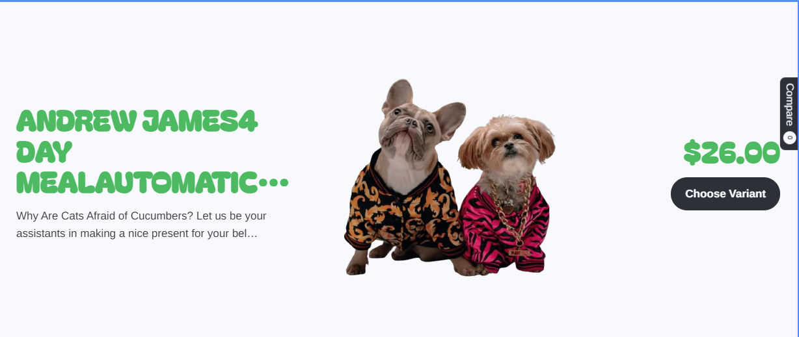

# 📂 Shopify Custom Sections Collection

This repository contains my custom Shopify sections.  
Each section includes a preview image, its name, and a quick button to open the related folder/code..

---

## 🖼 Section Previews

### 1. Custom Image Text Section

[➡️ Go to Code](./custom-text-image-text)

---

### 2. Split Layout Banner

[➡️ Go to Code](./sections/split-layout-banner)

---

### 3. Product Showcase with Button

[➡️ Go to Code](./sections/product-showcase)

---

## 🚀 How to Use
1. Copy the section file into your Shopify theme's `/sections/` folder.  
2. Add the section to a page using the Shopify theme editor.  .
3. Customize using the schema settings provided.

---

## 📝 Updates
I will keep adding more sections with images and links. Stay tuned!  
